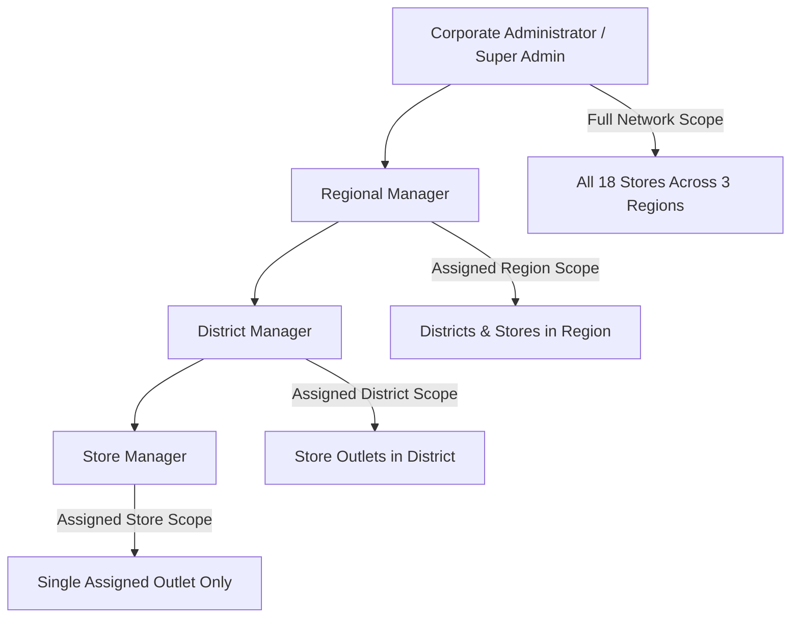
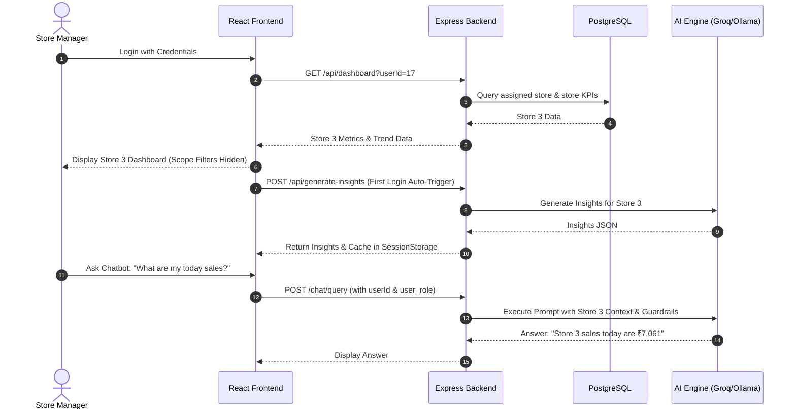
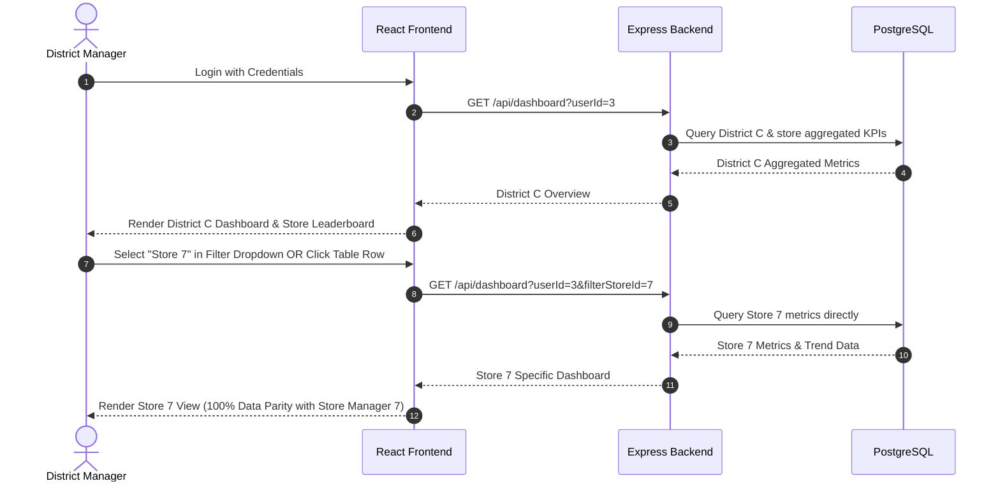

# Ocean View RMS — End-to-End User Flows & Detailed Use Cases

---

# SECTION I: END-TO-END SYSTEM USER FLOWS

This section details the step-by-step operational workflows for all four administrative user tiers in the Ocean View Restaurant Management System.

---

## 1. Store Manager User Flow

### 1.1 Step-by-Step Flow Execution
1. **Authentication & Role Resolution**: Store Manager logs in. Backend resolves role as `Store Manager` and isolates `assigned_store_id` (e.g., `Store 3`).
2. **Dashboard Rendering**:
   - Scope banner displays **Store 3**. Scope filter controls are automatically hidden.
   - Summary cards show Store 3's Revenue, Orders, Average Order Value, Customer Count, and Cancellation Rate.
   - **30-Day Trend & Order Channel Distribution**: Rendered strictly from `daily_store_kpis` database records for Store 3.
3. **AI Insights Generation**:
   - Triggers automatically **ONCE upon login**. Cached in `sessionStorage` to eliminate redundant LLM calls on page switches.
   - Re-generation occurs only when the user clicks **"⚡ Re-Generate Insights"**.
4. **AI Assistant Interactions**:
   - Chatbot context is strictly bounded to Store 3.
   - If Store Manager asks for non-assigned outlets or network totals, chatbot returns strict RBAC refusal message.

---

## 2. District Manager User Flow

### 2.1 Step-by-Step Flow Execution
1. **Authentication & Scope Setup**: System resolves user as `District Manager` assigned to `District C`.
2. **District Aggregate Overview**: Initial dashboard displays aggregated revenue, orders, and performance leaderboard for stores in District C (Store 7, Store 8, Store 9).
3. **Store Selection & Drill-Down**:
   - **Method 1**: Selects a store from the **Filter Scope** dropdown.
   - **Method 2**: Clicks any store row in the **Top 5 Ranked Stores Performance Leaderboard**.
4. **Data Parity Guarantee**: Re-fetches backend analytics using `filterStoreId=7`. Figures match **100% identically** with Store Manager 7's direct view.
5. **Chatbot Guardrail**: Questions regarding non-assigned districts or regional/network-wide sales trigger automated guardrail refusal.

---

## 3. Regional Manager User Flow

1. **Authentication**: System resolves user as `Regional Manager` assigned to `Region 2`.
2. **Regional Overview**: Displays aggregated metrics for all districts and stores under Region 2.
3. **Filter Navigation**: Allows filtering down to specific Districts within Region 2 or individual store outlets.
4. **Chatbot Boundaries**: Queries regarding other regions (Region 1, Region 3) or overall network totals trigger automatic access refusal.

---

## 4. Corporate Administrator / Super Admin User Flow

1. **Authentication**: System resolves user as `Corporate Administrator`.
2. **Unrestricted Network Dashboard**: Full visibility across all 18 stores, 9 districts, and 3 regions.
3. **User Management & Role Promotions**:
   - Accesses `/users` to create users, update emails, and promote roles.
   - Promoting a Store Manager to District Manager automatically updates scope mappings in PostgreSQL (`assigned_store_id = null`, `assigned_district_id = 3`).
4. **Clean Management UI**: Chatbot widget is automatically hidden for Admin roles.

---

# SECTION II: COMPREHENSIVE SYSTEM USE CASES

---

### USE CASE 1: Single-Store Operational Monitoring & Insights
- **Primary Actor**: Store Manager
- **Goal**: Monitor daily store sales, channel distributions, and receive AI operational recommendations.
- **Preconditions**: Store Manager is authenticated with `assigned_store_id`.
- **Main Flow**:
  1. Store Manager accesses the main Dashboard.
  2. System queries PostgreSQL for `store_id` metrics and renders summary cards.
  3. AI Insights panel displays executive summary, channel alerts, and recommendations for the store.
  4. Store Manager opens Chatbot and asks: *"What is my best performing channel today?"*
  5. Chatbot responds with exact database breakdown (e.g., Dine-In: 19 orders, Takeaway: 11 orders, Online: 7 orders).
- **Postconditions**: Operational decisions made based on real-time database figures.

---

### USE CASE 2: Multi-Store Performance Comparison & Store Drill-Down
- **Primary Actor**: District Manager
- **Goal**: Compare store performance within assigned district and inspect specific store outlets.
- **Preconditions**: User authenticated as `District Manager`.
- **Main Flow**:
  1. District Manager views aggregated District C metrics.
  2. Inspects Top Stores Leaderboard table.
  3. Clicks on "Store 7" row in the leaderboard table.
  4. Frontend dispatches `GET /api/dashboard?userId=3&filterStoreId=7`.
  5. System updates dashboard title to **Store 7** and displays exact store metrics.
- **Postconditions**: District Manager views exact single-store data matching Store Manager 7's dashboard.

---

### USE CASE 3: Role Promotion & Automatic Scope Maintenance
- **Primary Actor**: Corporate Administrator
- **Goal**: Promote a Store Manager to District Manager without orphan scope data.
- **Preconditions**: Administrator accesses `/users`.
- **Main Flow**:
  1. Admin locates user "Jane Doe" (currently Store Manager assigned to Store 3).
  2. Clicks **Edit User**, changes role to **District Manager**, and selects **District C**.
  3. System automatically sets `assigned_store_id = null` and `assigned_district_id = 3`.
  4. Admin clicks **Save Changes**.
  5. Backend updates database using double-quoted `"role" = $3` query.
- **Postconditions**: Jane Doe logs in as District Manager with District C scope and no residual store restriction.

---

### USE CASE 4: Offline / Local LLM Execution via Ollama Fallback
- **Primary Actor**: Any User (Store / District / Regional Manager)
- **Goal**: Receive AI Insights and Chatbot answers even during internet outages or cloud API rate limits.
- **Preconditions**: Local Ollama service active on `http://127.0.0.1:11434`.
- **Main Flow**:
  1. User triggers AI Insights or asks Chatbot question.
  2. Groq cloud API returns `429 Rate Limit Exceeded` or network timeout.
  3. System seamlessly falls back to `queryOllamaModel` using local model (`llama3.2` / `qwen2.5`).
  4. Response is returned to frontend with engine badge: `Local Ollama (llama3.2)`.
- **Postconditions**: Zero disruption to user workflow.

---

### USE CASE 5: RBAC Scope Violation & Refusal Guardrails
- **Primary Actor**: District Manager
- **Goal**: Ensure user cannot view data outside assigned operational boundary.
- **Preconditions**: District Manager authenticated for `District C`.
- **Main Flow**:
  1. District Manager opens AI Assistant chatbot.
  2. Inputs query: *"Show me sales for Region 2"*.
  3. Backend inspects user role and system prompt guardrails.
  4. AI Assistant intercepts query and returns strict refusal message:
     > *"As District Manager for District C, your authorization is strictly limited to your assigned district (District C) and its stores. You do not have permission to view regional data, other districts, or network-wide totals."*
- **Postconditions**: Data security and organizational privacy strictly maintained.
